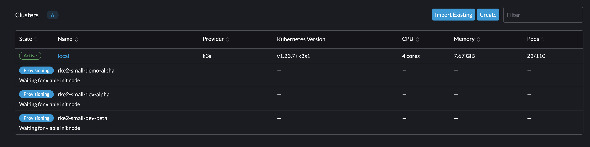
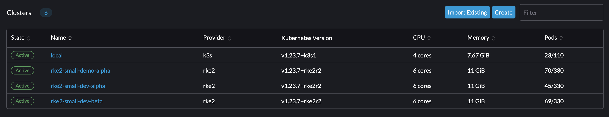

# Deploy a Stack
Using fleet we're going to deploy an entire stack, clusters and apps/services.

## Prereqs
* One Harvester node managed by Rancher with cloud credentials set
* Paved AWS account (VPCs and subnets) and cloud credentials set in Rancher Server if using the AWS cluster.
* kubectl with local cluster kubeconfig as current context
* running `Rancher Server`
* patched default `ClusterGroup` in `fleet-local` namespace (see below for how)
* *Optional* [kapp, ytt](https://carvel.dev), [kubecm](https://github.com/sunny0826/kubecm)

### Patching ClusterGroup
There's a bug in fleet right now that has yet to be fixed. It prevents us from deploying applications to our local cluster. This is an easy permanent fix, just run the below with your kube context pointed at your local cluster:
```console
make fleet-patch'
```

## Configuration
Due to how Rancher names credential and other related objects with unfriendly names, configuring the cluster yamls may require some editing to match them to whatever internal cloud credentials you have created in your Rancher instance.

To ease creation of cluster configs, I've added some ytt templating into `templates/` that can be utilized via the `Makefile` under the `cluster-generate-` targets defined. See the templates directory for examples of what that can look like. It is recommended you use these to generate cluster config yaml files as the helm templates (as all helm templates) are a very difficult read and do not flow in a natural way.

## Automatic HowTo
To obsurce away some of the Carvel tools, there is a Makefile in play that will allow you to dry-run and then run your workloads (which are GitRepo objects under the hood). Objects going to the `fleet-local` namespace are clusters and the others are applications.

Use `make workloads-check` to do a dry-run. And use `make workloads-yes` to do a full run. These are separated as such due to how kapp manages stdin-based yaml that it feeds to K8S. In the example below, we see two cluster loaders and one application (which will install apps on top of the associated clusters when they become available). You can specify a kubecontext to use using the `LOCAL_CLUSTER_NAME` variable when calling `make`.
```console
> make workloads-yes LOCAL_CLUSTER_NAME=my-local-cluster

===> Synchronizing Workloads with Fleet
Switched to context "rancher-aws".
Target cluster 'https://rancher.homelab.platformfeverdream.io/k8s/clusters/local' (nodes: ip-10-10-6-105)

Changes

Namespace      Name                Kind     Age  Op      Op st.  Wait to    Rs  Ri  
fleet-default  essentials          GitRepo  -    create  -       reconcile  -   -  
fleet-local    aws-cluster-loader  GitRepo  -    create  -       reconcile  -   -  
^              dev-cluster-loader  GitRepo  -    create  -       reconcile  -   -  

Op:      3 create, 0 delete, 0 update, 0 noop, 0 exists
Wait to: 3 reconcile, 0 delete, 0 noop

12:16:14PM: ---- applying 3 changes [0/3 done] ----
12:16:14PM: create gitrepo/aws-cluster-loader (fleet.cattle.io/v1alpha1) namespace: fleet-local
12:16:15PM: create gitrepo/dev-cluster-loader (fleet.cattle.io/v1alpha1) namespace: fleet-local
12:16:15PM: create gitrepo/essentials (fleet.cattle.io/v1alpha1) namespace: fleet-default
12:16:15PM: ---- waiting on 3 changes [0/3 done] ----
12:16:16PM: ok: reconcile gitrepo/essentials (fleet.cattle.io/v1alpha1) namespace: fleet-default
12:16:16PM: ok: reconcile gitrepo/aws-cluster-loader (fleet.cattle.io/v1alpha1) namespace: fleet-local
12:16:16PM: ok: reconcile gitrepo/dev-cluster-loader (fleet.cattle.io/v1alpha1) namespace: fleet-local
12:16:16PM: ---- applying complete [3/3 done] ----
12:16:16PM: ---- waiting complete [3/3 done] ----

Succeeded
```


## Manual HowTo
Easy mode for deploying is using Carvel's `ytt` and `kapp` applications. `ytt` is both a yaml template and overlay tool as well as a yaml aggregator, we can use it to recursively grab all yaml files in a directory and feed over to `kubectl` or `kapp`. `kapp` does similar to kubectl but will create the objects in order, and allow you to aggregate/track the deployment with an `app` name. This aggregation allows for a higher level view for tracking changes to the objects we manually change.

Assuming your kubeconfig context is set, you can kick this whole thing off with a simple command:
```console
╭─ ~/rancher/fleet-stack  on main !1 ······································································································ 0|1 х  at 16:27:21 ─╮
╰─ ytt -f workloads | kapp deploy -a fleet-workloads -f - -y                                                                                                   ─╯
Target cluster 'https://rancher.homelab.platformfeverdream.io/k8s/clusters/local' (nodes: rancher-server-node-0c292fd2-jkltk)

Changes

Namespace      Name                Kind     Age  Op      Op st.  Wait to    Rs  Ri  
fleet-default  app-platform        GitRepo  -    create  -       reconcile  -   -  
^              essentials          GitRepo  -    create  -       reconcile  -   -  
fleet-local    dev-cluster-loader  GitRepo  -    create  -       reconcile  -   -  

Op:      3 create, 0 delete, 0 update, 0 noop, 0 exists
Wait to: 3 reconcile, 0 delete, 0 noop

4:27:24PM: ---- applying 3 changes [0/3 done] ----
4:27:24PM: create gitrepo/app-platform (fleet.cattle.io/v1alpha1) namespace: fleet-default
4:27:24PM: create gitrepo/dev-cluster-loader (fleet.cattle.io/v1alpha1) namespace: fleet-local
4:27:24PM: create gitrepo/essentials (fleet.cattle.io/v1alpha1) namespace: fleet-default
4:27:24PM: ---- waiting on 3 changes [0/3 done] ----
4:27:24PM: ok: reconcile gitrepo/app-platform (fleet.cattle.io/v1alpha1) namespace: fleet-default
4:27:24PM: ok: reconcile gitrepo/dev-cluster-loader (fleet.cattle.io/v1alpha1) namespace: fleet-local
4:27:24PM: ok: reconcile gitrepo/essentials (fleet.cattle.io/v1alpha1) namespace: fleet-default
4:27:24PM: ---- applying complete [3/3 done] ----
4:27:24PM: ---- waiting complete [3/3 done] ----

Succeeded
```

The alternative using kubectl only require's doing a `kubectl apply` of all yaml files within `workoads`.

One this kicks off, we can view the clusters being built within our Rancher Server UI. Congrats, you've just kicked off a full-stack deployment using Fleet! This includes `LCM` or Lifecycle Management of RKE2 clusters themselves. Formerly, you would be required to enter the UI and deploy each of these items manually by clicking through menus. However, through the magic of Fleet and Rancher, your cluster configurations can be boiled down to a simple yaml file like [this one](gitops/clsuters/harvester1/demo/alpha/values.yaml)!

While that is running, you can view the section below to understand what a Fleet Stack is and why this is cool!


## Fleet Stack?
The term stack is pretty well-known and pretty informative as to what it is. It's a set of software designed/configured to work together to deliver a specific solution. Typically there are multiple layers of dependency involved in a stack and this particular case is no different.

### Infra/HCI
At the base layer we have our Infrastructure which is Harvester as HCI. Rancher supports provisioning RKE2/K3S clusters directly into Harvester in a similar way that it supports AWS, Azure, vSphere, etc. Here we're using Harvester as part of this demo.

### RKE2
At the platform layer we're going to be using RKE2 cluster instances. The default configuration here is for 3. One running on a low-core-count server called `harvester1` and another in AWS-Gov.

### Architecture
TODO: Drop in draw.io diagram

### Cluster Applications
At the application layer we're installing services like `cert-manager` and `longhorn` in an essentials package. These are configured to install on specific clusters using label selectors to demonstrate various methods of managing automation to clusters at scale using `Fleet`.

## Fleet LCM
What's really happening before your eyes is provisioning of a set of RKE2 clusters onto multiple Harvester instances as well as installation of the applications that run on top of it! This repo is a model of how a single git repository in production can manage many clusters and applications that run upon them at scale. Its structure is tailored to supporting this way of working. Because of naming conventions, directory structure and how it is presented, it can be very easy to onboard new platform engineers/operators in use of it.

### Workloads
The term workloads here stands for manual tasks/objects that we create inside our Rancher server, this is where the first kick event occurs, and if you check the HowTo section above, you can see we did just that. We fed all yaml files here into kapp/kubectl so they were created in our local rancher server. 

Clusters and applications are seperated here for convenience and for certain playbooks that might manage clusters and apps as seperate processes. Keep in mind, these files don't have to be in this directory structure, the workload files could exist anywhere. They are not consumed by a gitops process, they are only applied manually via `kapp` or `kubectl`. These files are only `GitRepo` objects defined within [Fleet's Docs](https://fleet.rancher.io/gitrepo-add/).
```console
workloads
├── apps
│   ├── app_platform.yaml
│   ├── essentials.yaml
│   └── monitoring.yaml.disabled
└── clusters
    └── dev_clusters.yaml
```

### GitOps
Within the `gitops` directory is where all gitops-based code is to be consumed. This directory structure matters a great deal as it is a way to distinguish *what* is being provisioned [cert-manager for example](gitops/apps/essentials/cert-manager/cert-manager/fleet.yaml) as well as *where* it is being installed. Note the directory structure itself defines first the level of the stack it applies to and then either which infra or the name of the base app/bundle to be installed. So at a glance, looking at the full path will tell the operator what the configuration belongs to without needing any manual inspection. This also allows for recursive inclusion of whole directories into a single `GitRepo` configuration. For instance, with the clusters we can include the entire `harvester1/demo` directory and track every single cluster that is part of that environment (the `demo` environment) as part of a single bundle. If we want to add a new cluster to this environment, it's as simple as creating a new folder copying the configs in and doing a `git-commit`. `¯\_(ツ)_/¯`

See the tree of the `gitops` directory. Note how cert-manager AND longhorn are colocated under the same parent, allowing them to be part of an essentials bundle that is installed on all clusters!
```console
gitops
├── apps
│   ├── app_platform
│   │   └── epinio
│   │       ├── fleet.yaml
│   │       └── values.yaml
│   ├── essentials
│   │   ├── cert-manager
│   │   │   ├── cert-manager
│   │   │   │   └── fleet.yaml
│   │   │   └── crds
│   │   │       ├── crds.yaml
│   │   │       └── fleet.yaml
│   │   └── longhorn
│   │       ├── fleet.yaml
│   │       └── values.yaml
│   └── monitoring
│       ├── crd
│       │   └── fleet.yaml
│       └── main
│           └── fleet.yaml
└── clusters
    ├── harvester1
    │   └── demo
    │       └── alpha
    │           ├── fleet.yaml
    │           └── values.yaml
    └── harvester2
        └── dev
            ├── alpha
            │   ├── fleet.yaml
            │   └── values.yaml
            └── beta
                ├── fleet.yaml
                └── values.yaml
```

## Cluster LCM
Admit it, this is the real reason you're here right? I put this section at the bottom because this is honestly the coolest part. A lot of folks still don't understand the magic of the K8S ClusterAPI (or CAPI for short). What it allows us to do is provision resources in a cloud in a cloud-agnostic way. EC2 instances are provisioned in the same way that vSphere and Harvester VMs are. 

The difference here it is that it is declarative and part of K8S instead of being separated into something clunky like Terraform or *gasp* Ansible playbooks. This allows your K8S management layer to control what resources it needs to provision in order to do LCM operations on the clusters it manages. All of it is centralized into K8S objects so it can all be managed with a single toolset and within a single workflow! It may not sound all that cool to some, but the time-savings alone is pretty spectacular. Ask yourself how things might be if K8S clusters were suddenly easy to create and delete on a whim? That day is now.

Rancher provides a great UI for managing these clusters across many clouds and environments from a single location. What you're seeing here is extending that feature into a GitOps-driven process. Instead of editing configurations within a UI, you're editing them in a git-repo because your clusters literally are now `infrastructure-as-code`.



### How It Works
Using the official [Rancher cluster template helm chart](https://github.com/rancher/cluster-template-examples), we can reference this chart within our `fleet.yaml` files and feed it a single values file defining our cluster.

Here's an example of the [demo-alpha cluster](gitops/clusters/harvester1/demo/alpha/fleet.yaml) referencing its helm chart and its [values file](gitops/clusters/harvester1/demo/alpha/values.yaml).  See the [Fleet.yaml spec here](https://fleet.rancher.io/gitrepo-structure/)
```yaml
defaultNamespace: default
helm:
  chart: https://github.com/rancher/cluster-template-examples/raw/main/cluster-template-0.0.1.tgz
  releaseName: cluster-template-demo-alpha
  valuesFiles:
    - values.yaml
---
cloudCredentialSecretName: cattle-global-data:cc-ltgct #! this value had to be looked up
cloudprovider: harvester
cluster:
  annotations: {}
  labels: 
    environment: dev
    cluster_name: alpha

  #! must be a unique name
  name: rke2-small-demo-alpha 

kubernetesVersion: v1.23.7+rke2r2
monitoring:
  enabled: false
rke:
  localClusterAuthEndpoint:
    enabled: false

nodepools:
#! name field must be unique across all clusters
- name: demo-control-plane-alpha
  displayName: control-plane
  etcd: true
  controlplane: true
  worker: false

  # specify node labels
  labels: {}

  # specify node taints
  taints: {}

  # specify nodepool size
  quantity: 1
  diskSize: 40
  diskBus: virtio
  cpuCount: 2
  memorySize: 4
  networkName: default/workloads
  networkType: dhcp
  imageName: default/image-d4cpg #! this value had to be looked up
  vmNamespace: default
  sshUser: ubuntu

#! name field must be unique across all clusters
- name: demo-worker-alpha
  displayName: worker
  worker: true

  # specify node labels
  labels: {}

  # specify node taints
  taints: {}

  # specify nodepool size
  quantity: 3
  diskSize: 40
  diskBus: virtio
  cpuCount: 2
  memorySize: 4
  networkName: default/workloads
  networkType: dhcp
  imageName: default/image-d4cpg #! this value had to be looked up
  vmNamespace: default
  sshUser: ubuntu


```